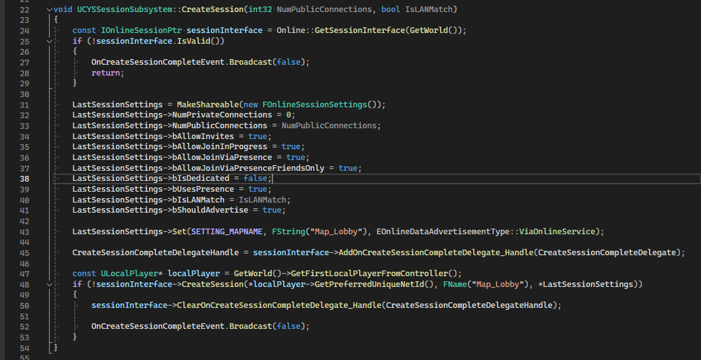
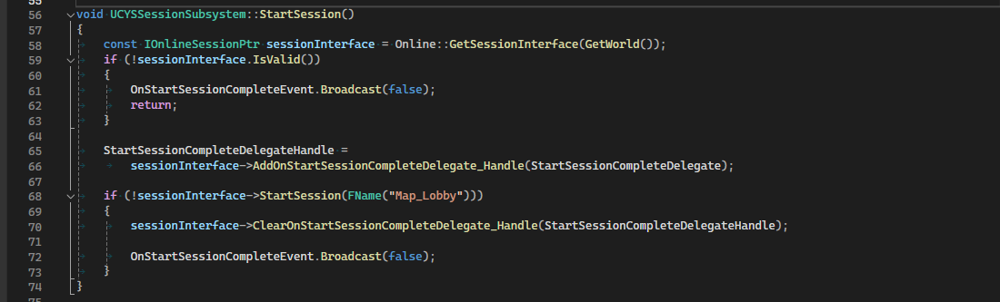
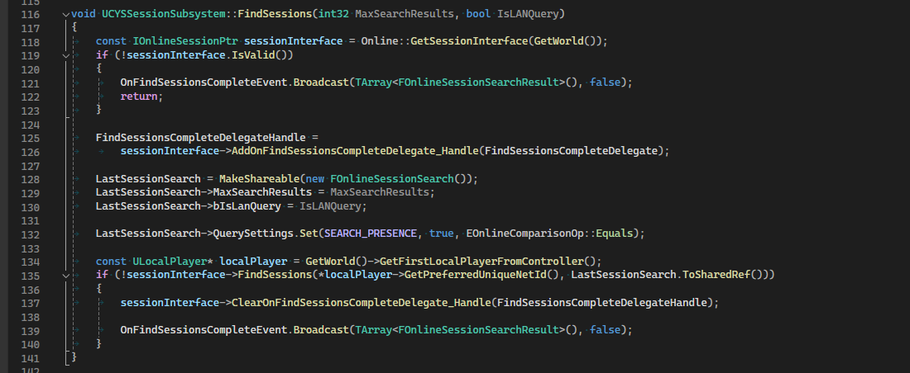
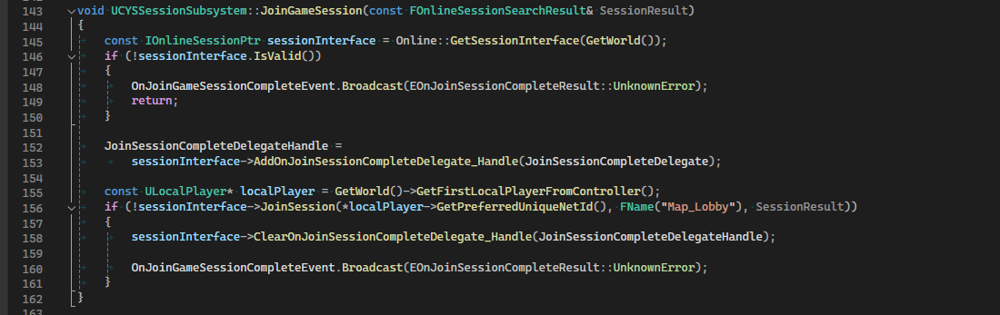
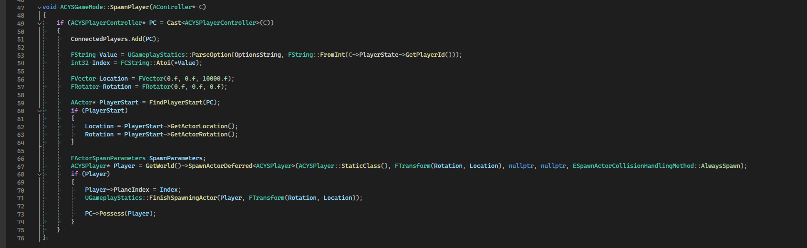
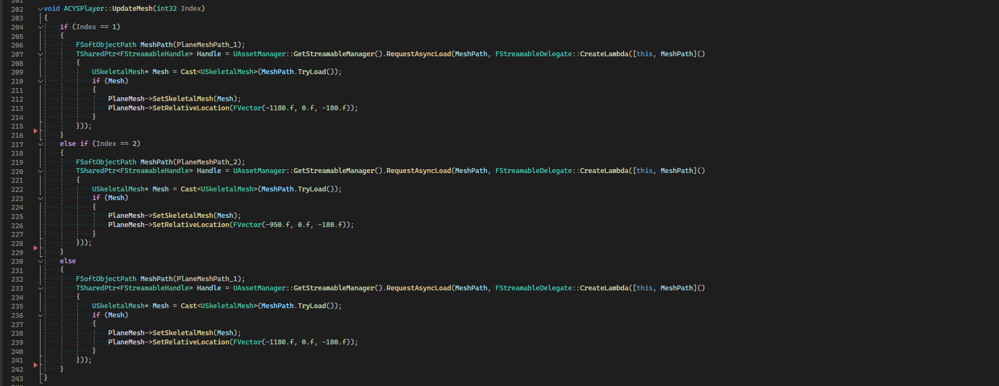
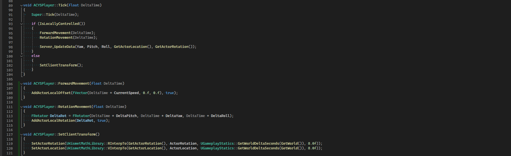
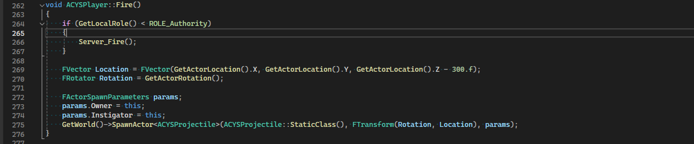
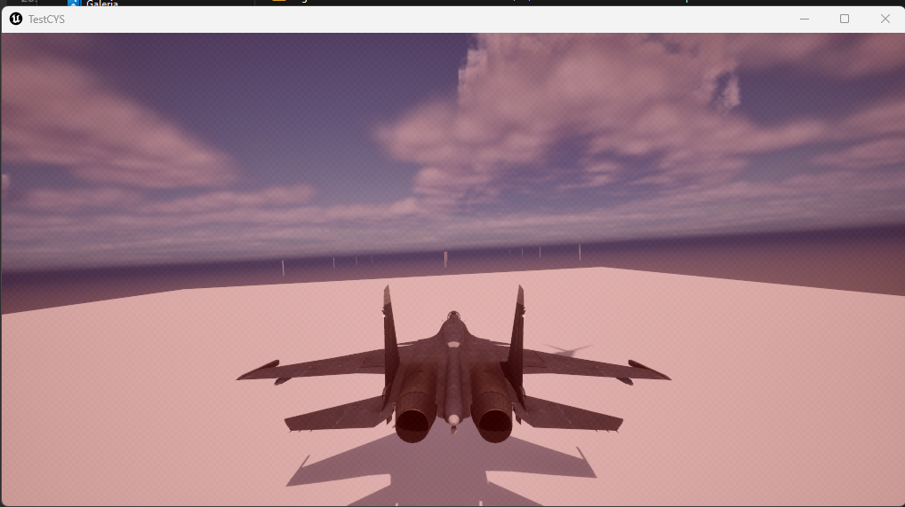

<a name="readme-top"></a>
<div align="center">
  <a href="https://github.com/othneildrew/Best-README-Template">
    
  </a>

  <h3 align="center">Plane Game Multiplayer</h3>

  <p align="center">
     Unreal Engine 5 Full Project C++ Multiplayer
    <br />
    <br />
    ·
    <a href="#">View Demo</a>
    ·
  </p>
</div>

<!-- ABOUT THE PROJECT -->
## Sobre o projeto

Um projeto feito em 3 dias, contando a partir de segunda feira, dia 08 de Abril de 2024 e terminado dia 10 de Abril de 2024. O propósito desse minigame é desenvolver uma base multiplayer de avião onde todas as classes criadas foram feitas no c++, sem blueprints.

## Classes

* Pawn
* GameMode
* HUD
* PlayerController
* OnlineSubsystem
* GameInstanceSubsystem
* Slate

<!-- GETTING STARTED -->
## Começando

Como todo projeto multiplayer, primeira coisa a ser criada foi o `Map_MainMenu`, pois sera o primeiro mapa a carregar ao inicar a aplicação. Então escolhi colocar um menu de botões, onde terá 3 opções:
* Criar sala
* Lista de salas
* Sair

Então ja que temos um sistema de sala e que não será hospedado em um servidor dedicado, precisei criar um sistema de coxexão `Host/Client` ou como a Unreal Engine chama `Listen Server`, com isso criei a classe `UCYSSessionSubsystem` que deriva como super da classe `UGameInstanceSubsystem`. Nessa classe tem as principais funções para criar uma conexão, são elas:

### Create Session
* Create Session -> Cria uma nova sessão com as configurações necessarias para o tipo de Lobby/Jogo. 


### Start Session
* Start Session -> Inicia a sessão criada anteriormente, deixando-a pronta para se conectar.


Se a sessão foi iniciada com sucesso, o `Map_Lobby` será chamado:
```sh
UGameplayStatics::OpenLevel(OwningHUD->GetWorld(), FName("Map_Lobby"), true, TEXT("?listen"));
```

### Find Session
* Find Session -> Encontra sessões onde o sistema de presença está habilidade, se a sessão foi criado com o `bShouldAdvertise` habilitado, então a sessão será encontrada. 


### Join Session
* Join Session -> Se conecta na sessão especificada, onde estão as informações das conexões dos outros clientes.


Se a conexão do jogador se juntou com a sessão criada com sucesso, o `Map_Lobby` será chamado:
```sh
const IOnlineSessionPtr sessionInterface = Online::GetSessionInterface(GetWorld());
if (!sessionInterface.IsValid())
{
	return false;
}

FString connectString;
if (!sessionInterface->GetResolvedConnectString(FName("Map_Lobby"), connectString))
{
	return false;
}

APlayerController* playerController = GetWorld()->GetFirstPlayerController();
playerController->ClientTravel(connectString, TRAVEL_Absolute);
return true;
```

## Lobby
Logo após todo esse processo do gerenciamento da sessão, a conexão entre o Host e Clients então finalizados.
Agora já no Lobby, foi instanciado apenas 3 classes:

* GameMode (Server)
* HUD (Client)
* PlayerController (Server/Client)

Essas são as unicas classe que usei para criar a conexão do Lobby, qualquer tipo de replicação necessaria entre os Jogadores e o Server foi feito no `ACYSPlayerController`.
A classe `ACYSLobbyMode` que deriva de `AGameMode`, tem um timer que é usada para checar se todos os Jogadores escolheram seus aviões, caso todos os Jogadores escolheram, então o `SeamlessTravel` será iniciado passando parametros dos Jogadores pelo `Options` do mapa.
Observação: A classe `ACYSLobbyMode` foi removido o Tick e habilitado a variavel `bUseSeamlessTravel`, essa variavel `bUseSeamlessTravel` é muito importante, pois ela que faz o servidor troca o level levando todos os Jogadores da sessão com o seguinte codigo:
```sh
if (PlayersReady >= ConnectedPlayers.Num())
{
	GetWorldTimerManager().ClearTimer(TimerHandle_Loop);

	FString Opt;
	for (auto& PC : ConnectedPlayers)
	{
		if (ACYSLobbyController* NPC = Cast<ACYSLobbyController>(PC))
		{
			Opt += FString::Printf(TEXT("?%s=%d"), *FString::FromInt(NPC->PlayerState->GetPlayerId()), NPC->PlaneIndex);
		}
	}

	FString Cmd = TEXT("ServerTravel");
	FString MapPath = TEXT("/Game/Maps/Map_Game");

	FString Command = FString::Printf(TEXT("%s %s%s"), *Cmd, *MapPath, *Opt);
	if (IConsoleManager::Get().ProcessUserConsoleInput(*Command, *GLog, GetWorld()) == false)
	{
		if (GEngine)
		{
			GEngine->Exec(GetWorld(), *Command);
		}
	}
}
```
## Game

Agora no carregamento do `Map_Game` seu `ACYSGameMode` será instanciado, com isso, utilizei uma função do `AGameMode` da Unreal Engine chamado `HandleSeamlessTravelPlayer`, essa função após a finalização do Seamless Travel, todos os Jogadores que foram trazidos do `Map_Lobby` passarão por essa função, um por um. Nisso foi criado uma função de `SpawnPlayer` para criar a classe `ACYSPlayer` dos Jogadores.



## Player

A principal classe do jogo `ACYSPlayer` utiliza o event Tick da Unreal Engine para fazer a atualização de movemento, a Unreal Engine funciona de uma forma onde as classe são separadas por `NetMode`, ou seja, `ROLE_Authority`, `ROLE_AutonomousProxy`, `ROLE_SimulatedProxy`. Esses modos são muito importante para saber se o Jogador é Host ou Client.
Agora irei mostrar as funcionabilidades da classe `ACYSPlayer`:

### Update Mesh
Essa função atualiza a Mesh selecionada no `Map_Lobby`, Na função `SpawnPlayer` que mostrei anteriormente no `ACYSGameMode`, na criação da classe do player, foi passado o Index que veio configurado no Options do GameMode, com isso eu tenho o valor da Mesh selecionada pelo player no Lobby.
Observação: Utilizei um Index e vinculei esse index as mesh de forma Hardcode para economizar na replicação, pois um int32 tem apenas 4 Bytes e uma string tem muito mais, deixando o jogo mal otimizado.



### Tick
A função Tick que é atualizada a normalmente no maximo 120 vezes por segundo(Travado pelo editor), foi utilizada para fazer a replicação e suavização do movimento do avião.



Como a classe é replicada, tive que utlizar a função IsLocallyControlled() para função que serão feitas apenas localmente. Nisso as funções `ForwardMovement()` e `RotationMovement()` pegam o valor do Input do Player a atualiza a Localização e Rotação da classe.
Logo após isso as informações atualizadas de Localização e Rotação da classe são replicadas para o servidor com isso fazendo com que o servidor replique essas informações para todos os outros jogadores, sendo assim, os outros Jogadores serão atualizadas da nova posição do Player.

`ACYSPlayer.cpp`
```sh
void ACYSPlayer::Server_UpdateData_Implementation(float CustomYaw, float CustomPitch, float CustomRoll, FVector CustomLocation, FRotator CustomRotation)
{
    YawRep = CustomYaw;
    PitchRep = CustomPitch;
    RollRep = CustomRoll;
    ActorLocation = CustomLocation;
    ActorRotation = CustomRotation;
}
```
`ACYSPlayer.h`
```sh
	UFUNCTION(Unreliable, Server)
	void Server_UpdateData(float CustomYaw, float CustomPitch, float CustomRoll, FVector CustomLocation, FRotator CustomRotation);
```
### Fire
Os tiros feitos são mais simples, existe duas funções chamadas de `BindInputFirePressed()` e `BindInputFireReleased()` que quando o Jogador aperta o botão de atirar e solta, essas funções são chamadas. Na função de Pressed é criado um timer que atualiza a cada X segundos e esse Timer é parado quando o player solta o botão. Com isso foi criado um botão de tiro, que chama a função `BindInputFireOn()` onde essa função passa para o Server que o player "atirou" e spawna a classe `ACYSProjectile` que irá movimentar sozinha após o spawn e poderá atingir o outro Jogador, com isso causando dano.



### Dano
Os projeteis acertado de outro Jogador causarão dano no Jogador alvo.


